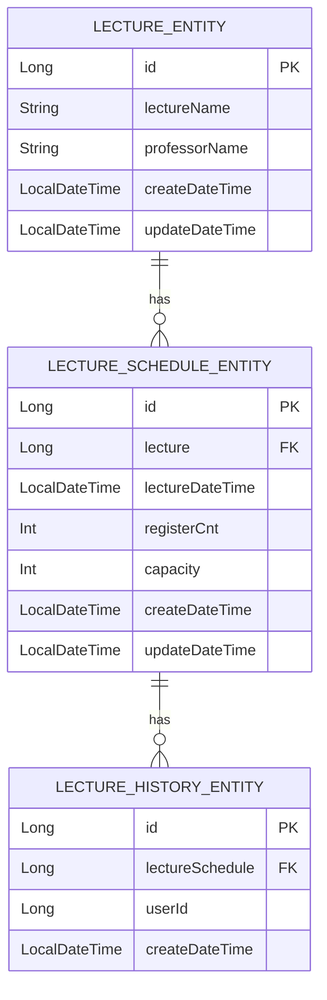

Lecture Entity (LECTURE_ENTITY):

강의(Lecture) 자체에 대한 정보를 담고 있습니다.
이 테이블은 여러 강의 스케줄과 관계를 맺고 있으므로,
관계로 LECTURE_SCHEDULE_ENTITY와 연결됩니다.

Lecture Schedule Entity (LECTURE_SCHEDULE_ENTITY):

강의 스케줄을 나타내는 테이블로, 특정 강의(Lecture)에서 제공되는 강의 일자와 정원 관리를 담당합니다.
이는 여러 명의 학생이 신청할 수 있으므로
관계로 LECTURE_HISTORY_ENTITY와 연결됩니다.

Lecture History Entity (LECTURE_HISTORY_ENTITY):

특강 신청 기록을 관리하는 테이블입니다.
이 테이블은 학생들이 특정 강의 스케줄에 대해 여러 번 신청할 수 없도록 하기 위해, lectureSchedule과 userId가 복합적으로 고유하게 관리될 수 있습니다.

## 설계 이유
효율적인 관계 관리:
LECTURE_ENTITY, LECTURE_SCHEDULE_ENTITY, LECTURE_HISTORY_ENTITY가 각각 1
관계로 구성되어 있어 강의 하나에 여러 스케줄을, 스케줄 하나에 여러 신청 내역을 관리할 수 있습니다. 이 구조는 강의와 강의 스케줄 간의 관계, 그리고 강의 스케줄과 신청 기록 간의 관계를 명확하게 정의해줍니다.

확장성:
강의 스케줄을 독립된 테이블로 관리함으로써, 다양한 시간대와 강의 형태를 추가하는 데 유연성을 제공합니다. 한 강의가 여러 날짜에 제공될 수 있으므로, LECTURE_SCHEDULE_ENTITY를 통해 다양한 스케줄을 확장할 수 있습니다.

데이터 무결성:
각 엔티티 간의 외래 키를 사용하여, 강의와 강의 스케줄 및 신청 내역 간의 관계를 명확히 유지함으로써 데이터의 무결성을 보장합니다. 예를 들어, 강의가 삭제되면 관련 스케줄도 삭제되도록 처리할 수 있습니다.

학생 신청 관리의 효율성:
LECTURE_HISTORY_ENTITY를 통해 특정 학생이 어떤 스케줄에 신청했는지를 쉽게 관리할 수 있으며, 중복 신청 방지 및 신청 기록의 추적이 용이해집니다.

시간 정보 관리:
모든 테이블에 createDateTime과 updateDateTime을 두어, 데이터 생성 및 수정 이력을 관리하고 추적 가능하도록 설계했습니다. 이는 데이터 무결성과 감사 기능에 중요한 요소입니다.
